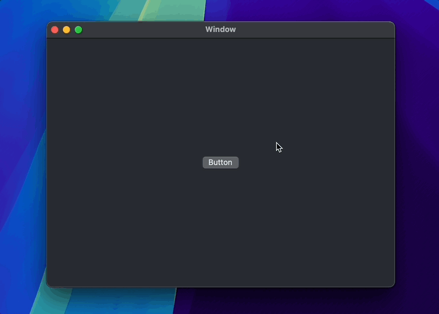
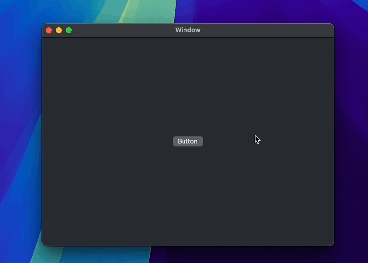
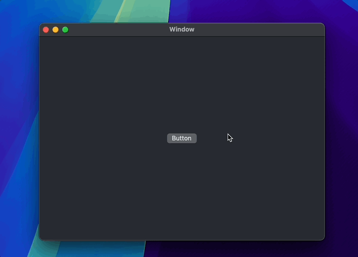
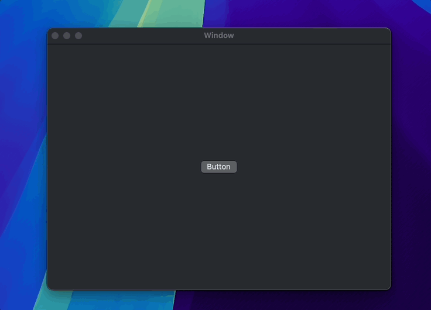

<p align="center">


<p align="center"> <b>LCNotificationBanner is a lightweight macOS notification banner component!</b></p>

<p align="center">


<a href="https://twitter.com/LiuChuan_"></a>
</p>

---


## Banner display position

- **Using enumerations to define `LCNotificationBannerPosition `** 

```swift
public enum LCNotificationBannerPosition {
    case top
    case bottom
    case leftCenter
    case rightCenter
}
```


## Preview of Notification Animations

|  |  | |
| :------------: | :------------: | :------------: |
| Success | Error |  Info  |


|  |  |  |   |
| :------------: | :------------: | :------------: | :------------: |
|  Only Text | rightCenter  | leftCenter | bottom|


## How to use

#### Provide Success, Info, Warning, Error, and Custom banner type

- Background color

```swift
LCNotificationBanner.shared.bgColor = NSColor.systemBlue.cgColor
```

- Position

```swift
LCNotificationBanner.shared.position = .top
```

- Success type

```swift
LCNotificationBanner.showSuccessWithStatus("This is a banner title", style: .dark, to: view.window)
```

- Error type

```swift
LCNotificationBanner.showErrorWithStatus("This is a banner title", style: .dark, to: view.window)
```

- Info type

```swift
LCNotificationBanner.showInfoWithStatus("This is a banner title", style: .dark, to: view.window)
```

- Text type only

```swift
LCNotificationBanner.showTextWithStatus("This is a banner title", to: view.window)
```


## Installation

### CocoaPods
LCNotificationBanner is available through [CocoaPods](https://cocoapods.org). To install it, simply add the following line to your Podfile:


```swift
pod 'LCNotificationBanner'
```


## License

MIT License

Copyright (c) 2024 Marvin


## Author

| [](https://github.com/DevLiuSir)  |  [DevLiuSir](https://github.com/DevLiuSir)<br/><br/><sub>Software Engineer</sub><br/> [][1] [][2] [][3]|
| :------------: | :------------: |

[1]: https://twitter.com/LiuChuan_
[2]: https://github.com/DevLiuSir
[3]: https://devliusir.com/